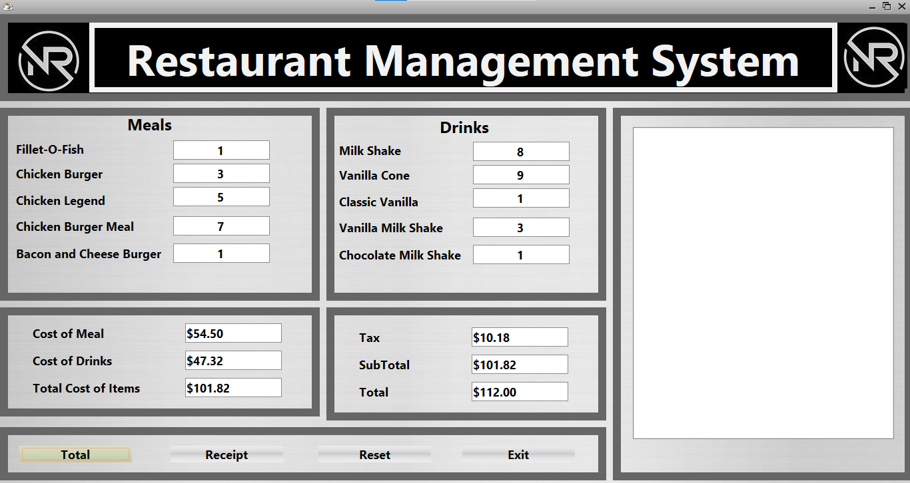
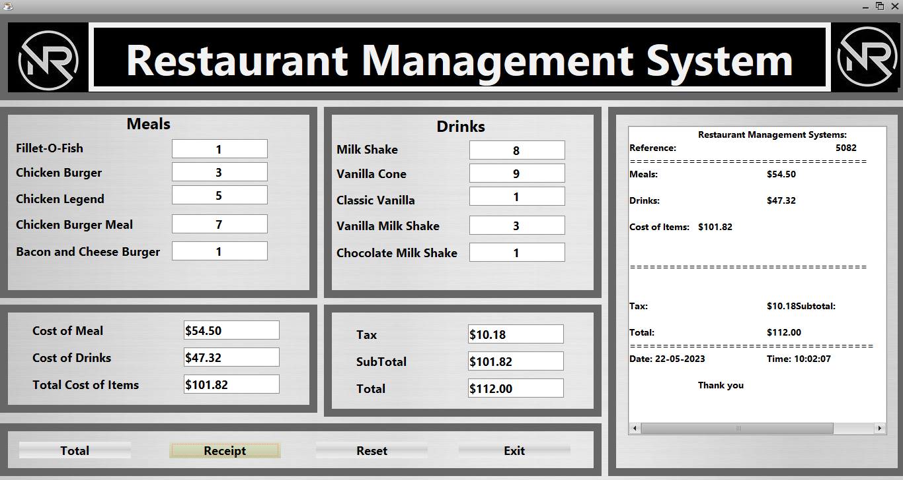
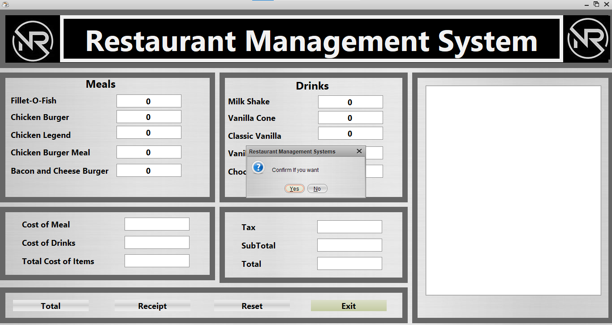

# Restaurant Management System

# Project-Documentation 

<p align="center">
  <a href="" rel="noopener">
 </a>
</p>


<h3 align="center">Restaurant Management System</h3>

---

<p align="center"> This app is used for Restaurant management. To reduce the work of the Restaurant's Employee.
    <br> 
</p>

---

## 📝 Table of Contents
- [About](#about)
- [Getting Started](#getting_started)
- [Deployment](#deployment)
- [Usage](#usage)
- [Flow Chart](#flowchart)
- [TODO](../TODO.md)
- [Contributing](../CONTRIBUTING.md)
- [Authors](#authors)
- [Acknowledgments](#acknowledgement)


## 🧐 About <a name = "about"></a>
Restaurant Management Software assists restaurant owners and managers with automation of administrative tasks, workforce management & scheduling, inventory tracking & control, orders, and payroll.There is some overlap between restaurant management software and POS systems. Restaurant POS systems are primarily concerned with taking customers orders, submitting orders to the kitchen, processing payments, and providing basic analytics.


## 🏁 Getting Started <a name = "getting_started"></a>
The following things are required before we start our project.

### Prerequisites
The following softwares are required before we start our project.

```
Java - JDK 18
Java IDE - Netbeans
```

### Installing
Here we can explain the step by step procedure to install those above softwares.

```
1. Java - JDK 18
    a. Go to the chrome browser and search Java JDK Download
    b. Go to the website "https://www.oracle.com/java/technologies/downloads/".
    c. And click x64 "Compressed Archive" for download them.
    d. After download that we need to install that.
    e. After the installation is complete, we have to configure environment variables to notify the system about the directory in which JDK files are located. Proceed to C:\Program Files\Java\jdk-{YOUR_JDK_VERSION}\bin (replace {-} with your JDK version).
    f. To set the Environment Variables, you need to search Environment Variables in the Task Bar and click on “Edit the system environment variables”.
    g. Under the Advanced section, Click on “Environment Variables”.
    h. Under System variables, select the “Path” variable and click on “Edit”. Click on “New” then paste the Path Address i.e. C:\Program Files\Java\jdk-{YOUR_JDK_VERSION}\bin. Click on “OK”.
    i. Now, in the Environment Variables dialogue, under System variables, click on “New” and then under Variable name: JAVA_HOME and Variable value: paste address i.e. C:\Program Files\Java\jdk-{YOUR_JDK_VERSION}. Click on OK => OK => OK.
    j. Open Command Prompt and enter "java -version " to check version of jdk.
```
```
2. Java IDE - Netbeans
    a. We need to have a setup file of the NetBeans JAVA into your setup. For get that setup file, we need to download that from "https://netbeans.org/images_www/v6/download/community/17.0/".
    b. Right-click on the setup or you can Double-Click on the setup by using the mouse.
    c. Click on the next option.
    d. Check on the “Private networks, such as my home and work network”.
    e. Click on the Allow access button.
    f. Check on the “I accept” option and click on the “Next” button.
    g. Select the path where you want to install the software and press the “Next” button.
    h. We need to selct the path for our Netbeans software and click on the “Next” button.
    i. Click on the “Install” button.
    h. After complication of the setup you can click on the “Finish” button or you can also register the Software, for Further Assistance because it is a Free Software.
```

## 🔧 Running the tests <a name = "tests"></a>
1. This is the main page of our Project.
<p align="center">
  <a href="" rel="noopener">
 </a>
</p>


2. After this We can give the input. i.e., Number of products which the customer buys.
<p align="center">
  <a href="" rel="noopener">
 </a>
</p>


3. After get the inputs from the user. Then click the Total Button.
<p align="center">
  <a href="" rel="noopener">
 </a>
</p>
<p> -After click the total button, we add the Meals products and Drinks products cost.<br>
    - And then add Cost of Meals and Drinks as "Total cost of items".<br>
    - And then it showed as "Sub-total" in another category.<br>
    - Then the main thing is calculate the tax cost for total amount. Tax formula = Total amount - (Total amount * 0.90).<br>
    - And then finally shows the Total amount. i.e., "Sub total + Tax ". Name as "Total".<br>
 </p>
 
 4. After this we click the Reciept button. Then it shows all details i.e., date, amount, tax etc.,
 <p align="center">
  <a href="" rel="noopener">
 </a>
</p>


 5. Then we click "Reset" Button, it goes to normal page.
   <p align="center">
  <a href="" rel="noopener">
 </a>
</p>

 6. Then if we click Exit button. It shows popup menu. If we click "Yes", it will close. Otherwise, it backs to the page.
   <p align="center">
  <a href="" rel="noopener">
 </a>
</p>


## ⛏️ Flow Chart <a name = "flowchart"></a>

<p align="center">
  <a href="" rel="noopener">
 </a>
</p>
